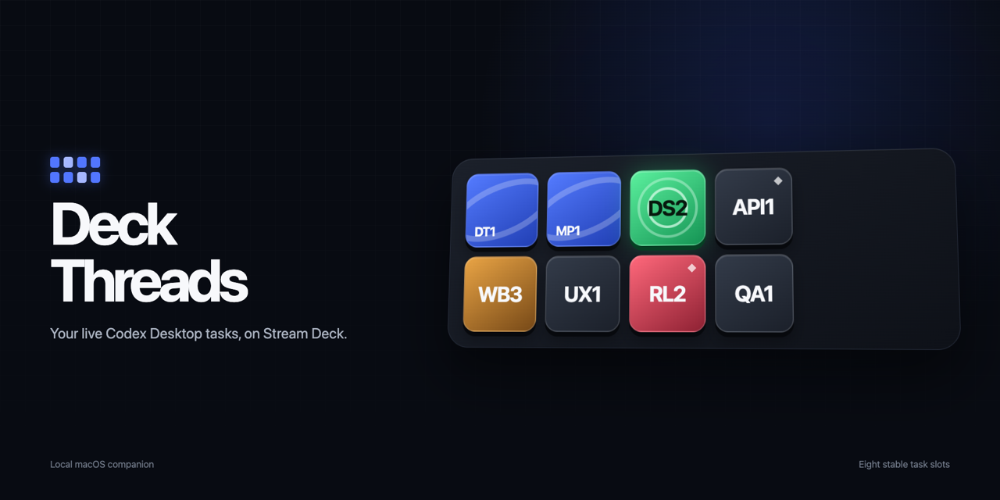

# Deck Threads

Deck Threads puts your live Codex and Claude Code tasks on Stream Deck. Eight keys show the work that matters now, hold their physical positions while a task remains selected, and open the exact task in its owning app with one press.



Deck Threads is an independent, open-source utility. It is not affiliated with or endorsed by Anthropic, OpenAI, or Elgato.

## What it does

- Shows eight prioritized Codex and Claude Code tasks in a 4 × 2 Stream Deck layout.
- Reserves four keys for each app by default, with any split from 0/8 to 8/0 available in **Sources**.
- Fills unused reservations with active tasks from the other app by default, so six Codex tasks and two Claude tasks use all eight keys.
- Prioritizes tasks that need attention, followed by working, unread, pinned, and recent work.
- Keeps active tasks in stable physical slots, including across companion restarts.
- Uses compact project-local labels such as `DT1` and `MP2` without renumbering tasks when live priority changes.
- Uses a blue border for Codex and an orange border for Claude, without placing a source label over the task title.
- Distinguishes working, question, unread, read, waiting, and error states with muted status-colored surfaces and motion.
- Lets you choose, per state, whether Stream Deck keys show the full task title or only the compact project label.
- Keeps Threads, Sources, Connections, Key labels, and Activity in separate companion views.
- Shows pinned Codex and Claude tasks, excludes archived tasks, and uses the same Claude task names shown in the Claude sidebar.
- Opens the exact existing task in Codex or Claude when pressed, including Claude tasks whose desktop and CLI session IDs differ.
- Runs locally in the macOS menu bar and starts automatically at login.
- Keeps task data on your Mac; the companion only listens on `127.0.0.1`.

## Requirements

- macOS 13 Ventura or later on Apple silicon or Intel.
- [Codex Desktop](https://openai.com/codex/), [Claude Code](https://code.claude.com/docs/en/overview), or both installed. Claude Desktop includes Claude Code.
- Stream Deck 7.1 or later.
- A keypad Stream Deck device. The bundled profile is designed for Stream Deck +; the action can be placed manually on other keypad models.

## Install

1. Open the [latest Deck Threads release](https://github.com/rschwabco/deck-threads/releases/latest).
2. Download `Deck-Threads-Installer.pkg` to install the companion and Stream Deck plugin together.
3. If Stream Deck Marketplace already manages the plugin, download `Deck-Threads-Companion.pkg` instead.
4. Open the package and complete the macOS Installer steps. Deck Threads adds a menu-bar item and enables launch at login.
5. Keep Codex Desktop and/or an active Claude Code session running alongside Stream Deck. The bundled 4 × 2 profile installs automatically on Stream Deck +.

For device-specific setup, manual action placement, verification, and uninstall instructions, see the [complete setup guide](docs/SETUP.md).

After the first signed installation, Deck Threads checks GitHub Releases for updates. When a newer version is available, the companion shows an **Update now** action, downloads the signed update, restarts, and keeps an already-installed Stream Deck plugin in sync.

## How it works

The macOS companion reads Codex Desktop's local runtime state and asks the local Codex app-server for the same task titles shown in the Codex sidebar. It discovers active Claude Code sessions through Claude's local agent registry, derives lifecycle state from local session events, and maps each CLI session to Claude Desktop metadata for sidebar titles, pins, archive state, and reliable task switching. It applies your source allocation, assigns the selected tasks to stable slots, and exposes that state through a loopback-only HTTP service on `127.0.0.1:9876`. The Stream Deck plugin polls that service, renders each key locally, and asks the companion to open the matching `codex://` or `claude://` deep link when pressed.

No OpenAI or Anthropic API key is required. Deck Threads has no analytics, account system, cloud storage, or remote backend.

## Documentation

- [Complete setup guide](docs/SETUP.md)
- [Troubleshooting](docs/TROUBLESHOOTING.md)
- [Privacy](docs/PRIVACY.md)
- [Support](docs/SUPPORT.md)
- [Development](docs/DEVELOPMENT.md)
- [Release process](docs/RELEASING.md)

## Build from source

```bash
git clone https://github.com/rschwabco/deck-threads.git
cd deck-threads
npm install
npm --prefix stream-deck install
npm run test:state
npm run build
npm run streamdeck:pack
```

Creating a public macOS release additionally requires an Apple Developer account, Developer ID Application and Installer certificates, and notarization credentials. See [Releasing](docs/RELEASING.md).

## License

[MIT](LICENSE)
